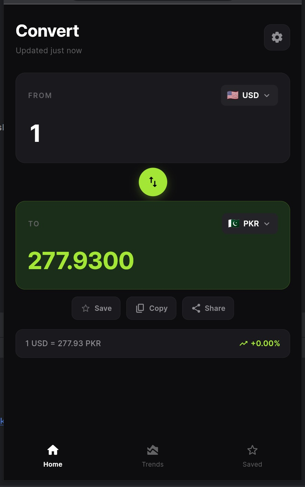
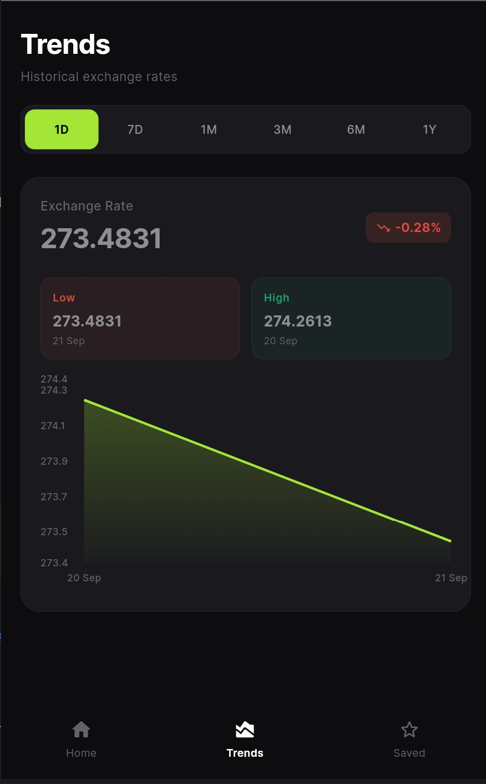
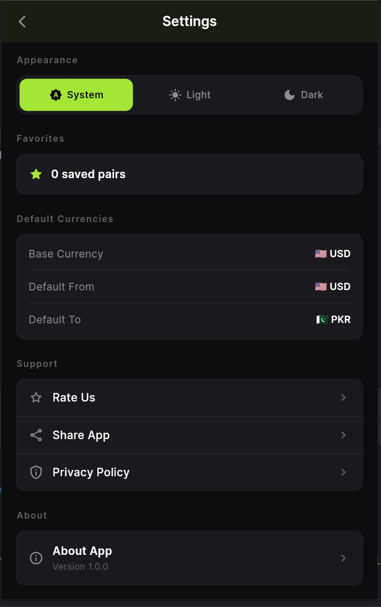
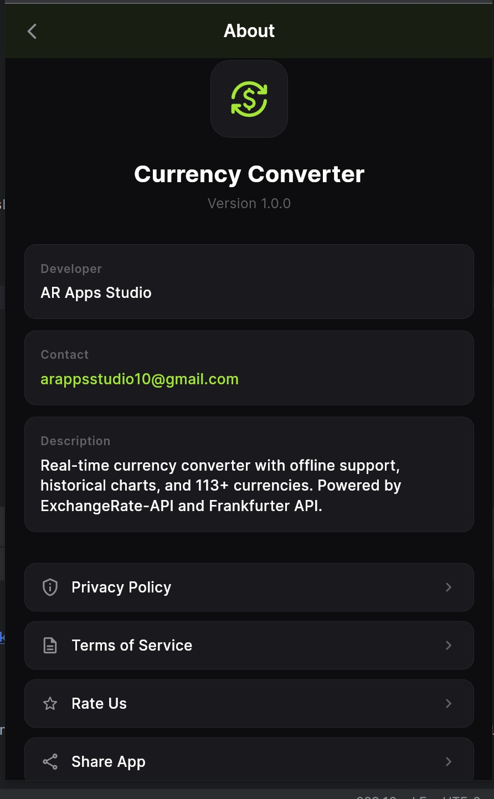

# 💱 AR Currency Converter

A beautiful, feature-rich **Flutter** currency converter app with real-time exchange rates, historical trend charts, offline support, and 100+ world currencies.

---

## 📱 Screenshots

> Add your app screenshots here after taking them from a device or emulator.

---

## ✨ Features

- 🔄 **Real-time Exchange Rates** – Live rates powered by [ExchangeRate-API](https://www.exchangerate-api.com)
- 📊 **Historical Trends Chart** – View 7/30/90-day rate trends via Frankfurter API
- 🌐 **100+ World Currencies** – USD, EUR, GBP, PKR, INR, AED, and many more
- ⭐ **Favorite Pairs** – Save and quickly access your most-used currency pairs
- 📋 **Copy & Share** – Copy conversion results or share them instantly
- 📶 **Offline Support** – Cached rates available when there's no internet
- 🌙 **Dark / Light / System Theme** – Follows system or manually toggleable
- 🔃 **Swap Button** – Instantly swap FROM and TO currencies
- 🕐 **Last Updated Timestamp** – Know exactly when rates were last fetched
- 📲 **Portrait Lock** – Optimized for portrait-mode usage

## 📸 Screenshots
<p align="center">
  
  
</br>
  
  
</p>


---

## 🛠️ Tech Stack

| Technology | Usage |
|---|---|
| [Flutter](https://flutter.dev) | Cross-platform UI framework |
| [Dart](https://dart.dev) | Programming language |
| [Riverpod](https://riverpod.dev) | State management |
| [Dio](https://pub.dev/packages/dio) | HTTP client for API calls |
| [Hive](https://pub.dev/packages/hive) | Local NoSQL database for caching |
| [FL Chart](https://pub.dev/packages/fl_chart) | Beautiful trend charts |
| [Google Fonts](https://pub.dev/packages/google_fonts) | Inter font family |
| [Share Plus](https://pub.dev/packages/share_plus) | Native sharing functionality |
| [Connectivity Plus](https://pub.dev/packages/connectivity_plus) | Offline detection |
| [Shared Preferences](https://pub.dev/packages/shared_preferences) | Settings persistence |

---

## 🏗️ Project Structure

```
lib/
├── constants/
│   └── app_constants.dart       # App name, API config, all 100+ currencies
├── models/
│   ├── currency.dart            # Currency model (code, name, symbol, flag)
│   └── exchange_rate.dart       # Exchange rate model with conversion logic
├── providers/
│   ├── currency_provider.dart   # From/To currency & amount state
│   ├── exchange_rate_provider.dart # Rate fetching & caching logic
│   ├── favorites_provider.dart  # Saved pairs management
│   ├── services_provider.dart   # Dependency injection
│   └── theme_provider.dart      # Dark/Light/System theme state
├── screens/
│   ├── splash_screen.dart       # Launch screen
│   ├── home_screen.dart         # Main screen (Converter, Trends, Saved tabs)
│   ├── currency_selection_screen.dart # Currency picker with search
│   ├── settings_screen.dart     # Theme & preferences
│   ├── about_screen.dart        # About the app
│   ├── privacy_screen.dart      # Privacy policy
│   └── terms_screen.dart        # Terms of service
├── services/
│   ├── api_service.dart         # ExchangeRate-API + Frankfurter integration
│   └── storage_service.dart     # Hive caching layer
├── theme/
│   └── app_theme.dart           # Light & dark theme definitions
├── widgets/
│   ├── currency_card.dart       # Reusable currency input/output card
│   └── trend_colored_chart.dart # Color-coded line chart widget
└── main.dart                    # App entry point with Riverpod ProviderScope
```

---

## 🚀 Getting Started

### Prerequisites

- [Flutter SDK](https://flutter.dev/docs/get-started/install) **3.x or above**
- Dart SDK **^3.11.5**
- Android Studio / VS Code with Flutter extension
- Android or iOS device / emulator

### Installation

1. **Clone the repository**
   ```bash
   git clone https://github.com/your-username/currency_converter.git
   cd currency_converter
   ```

2. **Install dependencies**
   ```bash
   flutter pub get
   ```

3. **Run the app**
   ```bash
   flutter run
   ```

4. **Build for release (Android)**
   ```bash
   flutter build apk --release
   ```

---

## 🌐 APIs Used

| API | Purpose | Key Required? |
|---|---|---|
| [ExchangeRate-API](https://www.exchangerate-api.com/docs/free) | Live exchange rates | ❌ No (free tier) |
| [Frankfurter API](https://www.frankfurter.app) | Historical rates | ❌ No |

> ⚠️ **Note:** The free tier of ExchangeRate-API has rate limits. For production use, consider upgrading to a paid plan.

---

## 📦 Dependencies

```yaml
flutter_riverpod: ^2.6.1   # State management
dio: ^5.7.0                 # HTTP client
hive_flutter: ^1.1.0        # Local database
hive: ^2.2.3
shared_preferences: ^2.2.3  # Settings storage
intl: ^0.20.2               # Number & date formatting
connectivity_plus: ^6.1.3   # Network detection
google_fonts: ^6.2.1        # Inter font
fl_chart: ^0.68.0           # Charts
url_launcher: ^6.2.1        # Open URLs
share_plus: ^10.1.4         # Share functionality
```

---

## 🎨 Theme

The app supports three theme modes:
- **System** (default) – follows your device's theme
- **Light** – clean teal-accented light mode
- **Dark** – lime-green accented dark mode

---

## 🤝 Contributing

Contributions are welcome! Feel free to open issues or submit pull requests.

1. Fork the project
2. Create your feature branch: `git checkout -b feature/amazing-feature`
3. Commit your changes: `git commit -m 'Add amazing feature'`
4. Push to the branch: `git push origin feature/amazing-feature`
5. Open a Pull Request

---

## 📄 License

This project is licensed under the **MIT License** – see the [LICENSE](LICENSE) file for details.

---

## 👨‍💻 Author

**AR Currency Converter**  
Built with ❤️ using Flutter

---

> ⭐ If you found this project helpful, please consider giving it a star on GitHub!
